<div align="center">

# Dimensions Are Interchangeable

**Evidence That Task-Aware Embedding Pruning Does Not Outperform Random Selection**

[](paper/paper.pdf)
[](https://huggingface.co/datasets/heihei/prune-to-prosper-data)
[](LICENSE)

</div>

## Overview

Modern text embedding models produce high-dimensional vectors (768–4096 dimensions) where **dimensions are highly interchangeable**: randomly removing up to 75% of dimensions causes only minor performance degradation, and no intelligent selection strategy significantly outperforms random.

We systematically evaluate **5 pruning strategies** across **13 models** and **35 MTEB tasks**, finding that task-optimized selection provides only +2–5% improvement over random—despite being an oracle with full task-specific knowledge.

<p align="center">
  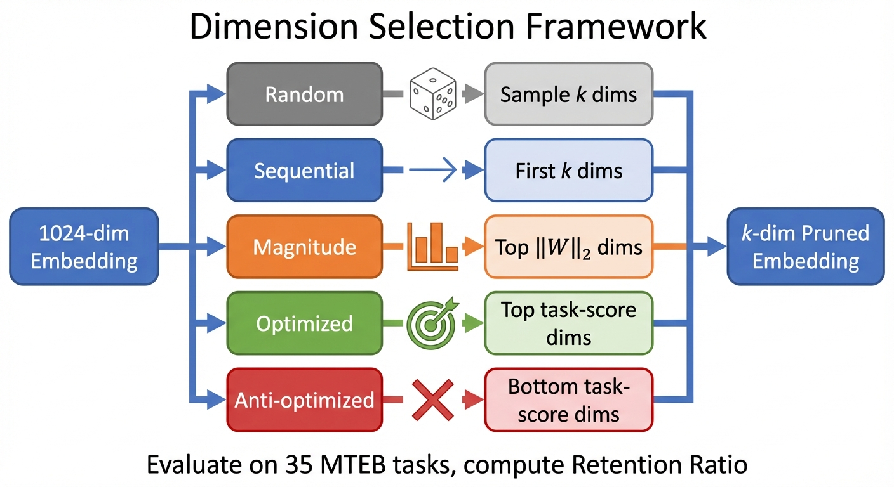
</p>

## Core Finding

<p align="center">
  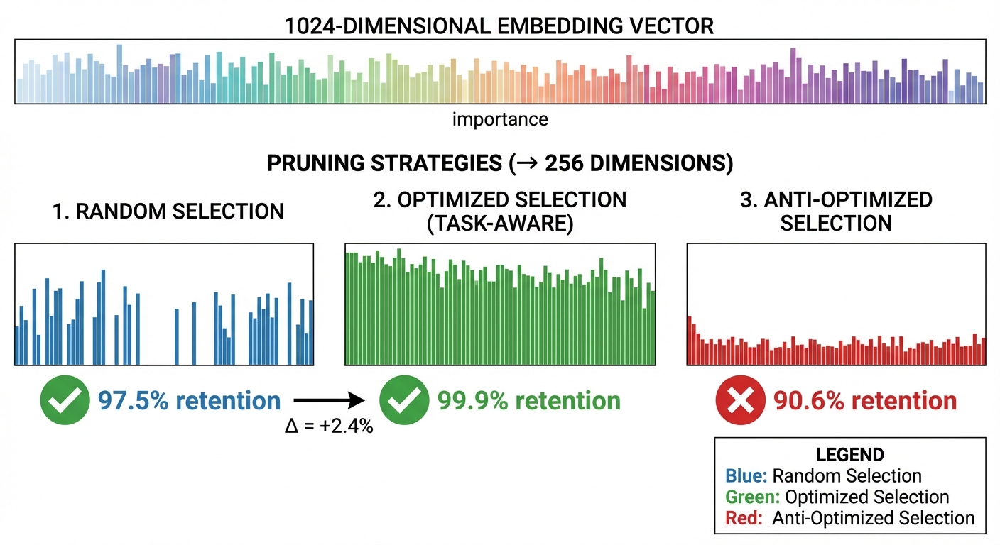
</p>

A 1024-dimensional embedding is reduced to 256 dimensions via three strategies:
- **Random** → 97.5% retention ✓
- **Optimized (Oracle)** → 99.9% retention ✓ (Δ = +2.4%)
- **Anti-optimized** → 90.6% retention ✗

The gap between random and the task-optimized oracle is only +2.4%, despite the oracle having full access to task-specific evaluation data that no practical system would have.

---

## Key Results

### Finding 1: Optimized ≈ Random

<p align="center">
  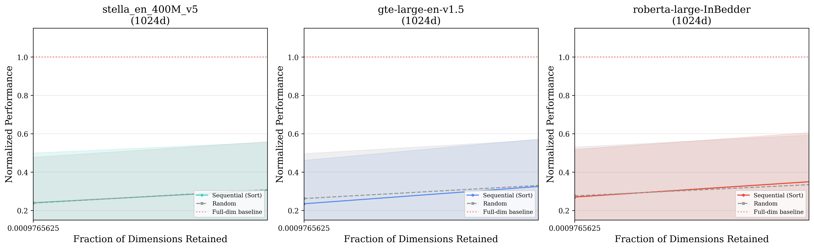
</p>

Retention ratio across pruning ratios for three models. The gap between Optimized (green) and Random (gray) is negligible for strong models (GTE-Large, Stella). Only Roberta-InBedder (a task-specifically fine-tuned model) shows a meaningful gap.

| Model | Δ (Opt − Rnd) | 95% CI | Cohen's d | p<sub>holm</sub> |
|-------|---------------|--------|-----------|---------|
| GTE-Large | +2.41% | [+1.49%, +3.39%] | 0.83 | <0.001 |
| Stella EN 400M | +3.22% | [+2.17%, +4.44%] | 0.93 | <0.001 |
| MxBai-Embed-Large | +2.24% | [+1.35%, +3.29%] | 0.76 | <0.001 |
| Instructor-Large | +2.89% | [+1.78%, +4.09%] | 0.83 | <0.001 |
| GTE-Base | +3.45% | [+2.11%, +4.93%] | 0.81 | <0.001 |
| BGE-M3 | +4.62% | [+3.21%, +6.13%] | 1.04 | <0.001 |
| GTR-T5-Large | +4.75% | [+2.98%, +6.67%] | 0.86 | <0.001 |
| Qwen3-Embedding | +5.01% | [+3.36%, +6.84%] | 0.97 | <0.001 |
| BART-Base | +10.08% | [+6.28%, +13.73%] | 0.90 | <0.001 |
| Roberta-InBedder | +8.19% | [+5.99%, +10.56%] | 1.17 | <0.001 |
| Roberta-Large | +8.56% | [−5.85%, +18.88%] | 0.23 | 0.191 |

<p align="center">
  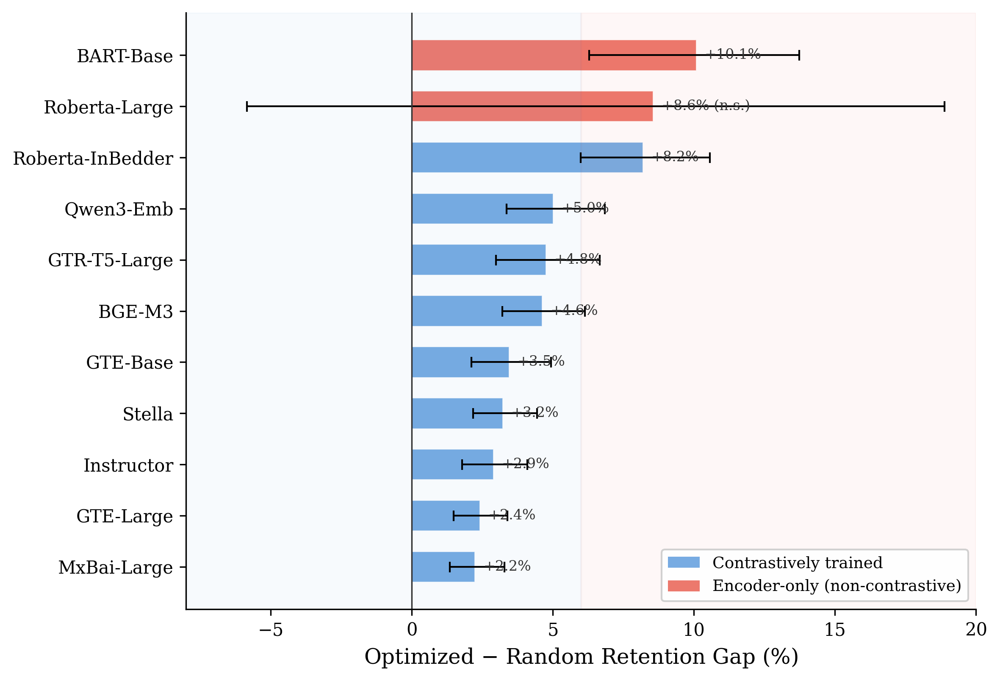
</p>

All contrastively-trained embedding models cluster in the +2–5% range, while non-contrastively trained encoder-only models show larger gaps.

### All Five Methods Comparison

<p align="center">
  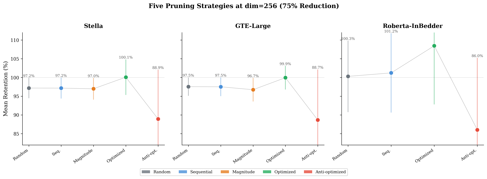
</p>

Random, Sequential, and Magnitude cluster together (96–98% retention), while Anti-optimized drops to 84–91%. The Optimized upper bound is only slightly above the cluster for strong models.

### Finding 2: Magnitude-Based Pruning Fails

<p align="center">
  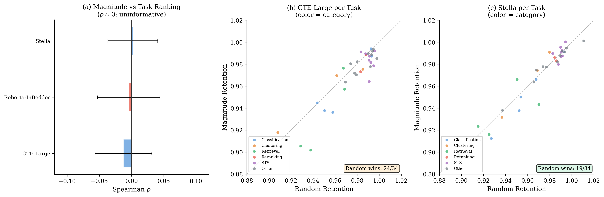
</p>

Magnitude-based dimension selection—the most intuitive heuristic—has **zero correlation** with task importance (ρ = −0.013 to +0.002). It performs equal to or **significantly worse** than random:

| Model | Magnitude Ret. | Random Ret. | p-value | Cohen's d |
|-------|---------------|-------------|---------|-----------|
| GTE-Large | 96.74% | 97.49% | 0.002 | −0.27 |
| Stella | 96.98% | 97.10% | 0.574 | −0.05 |

### Finding 3: Cross-Task Transfer Paradox

<p align="center">
  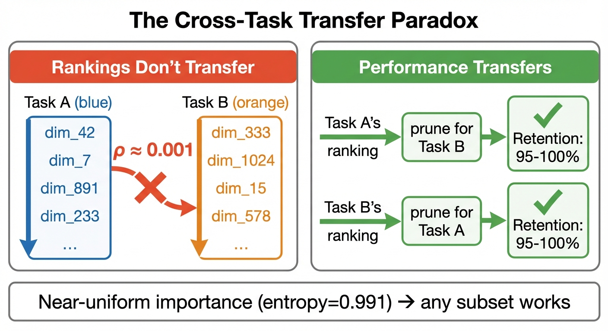
</p>

**The paradox**: Tasks completely disagree on *which* dimensions are important (ρ ≈ 0.001), but using any task's ranking to prune for any other task still retains 95–100% of performance.

<p align="center">
  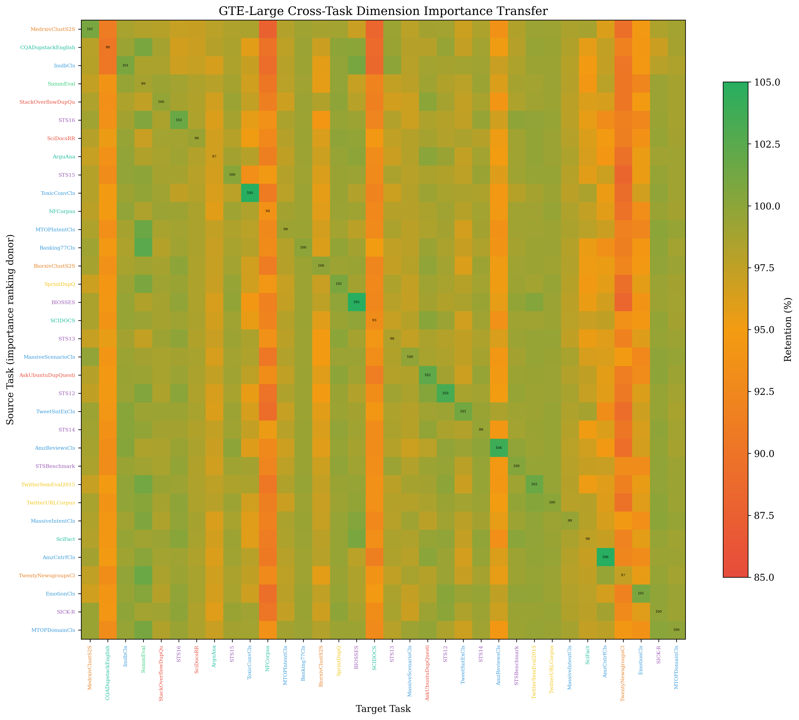
  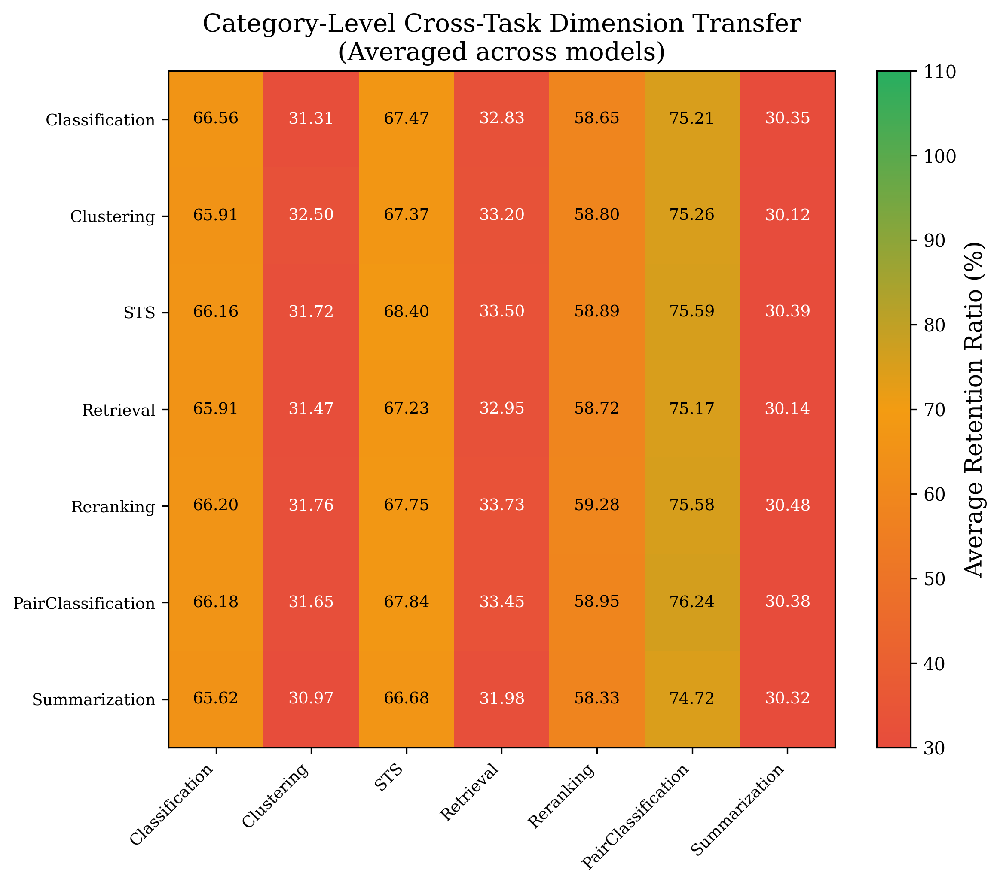
</p>

Cross-task transfer retention across 10 models:

| Model | Mean Transfer Ret. | 95% CI |
|-------|-------------------|--------|
| Roberta-Large | 100.4% | [87.9%, 123.8%] |
| Roberta-InBedder | 99.2% | [91.2%, 109.4%] |
| GTE-Large | 97.5% | [90.7%, 100.1%] |
| Stella | 97.4% | [91.2%, 100.7%] |
| MxBai-Embed-Large | 97.2% | [91.3%, 99.9%] |
| Instructor-Large | 96.9% | [89.7%, 100.4%] |
| Qwen3-Embedding | 96.8% | [96.6%, 97.1%] |
| GTE-Base | 96.7% | [91.4%, 100.1%] |
| GTR-T5-Large | 95.9% | [87.6%, 100.8%] |
| BGE-M3 | 94.8% | [81.2%, 101.1%] |

### Mechanism: Universal Redundancy

<p align="center">
  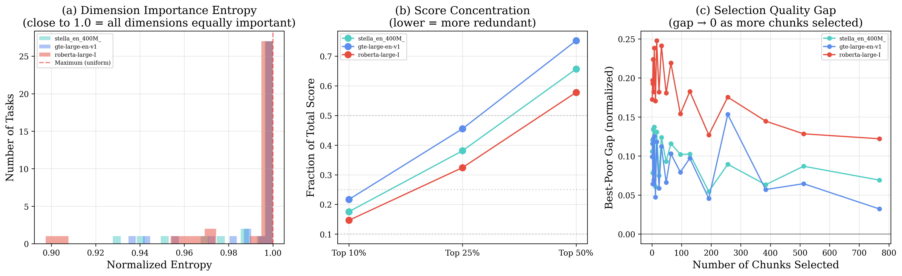
</p>

**Why** are dimensions interchangeable? Dimension importance is nearly uniform:

| Metric | GTE-Large | Stella | InBedder |
|--------|-----------|--------|----------|
| Normalized entropy | 0.993 | 0.992 | 0.988 |
| Gini coefficient | 0.017 | 0.017 | 0.022 |
| Chunk importance CV | 0.029 | 0.030 | 0.039 |
| Top-50% concentration | 51.2% | 51.2% | 51.5% |

Entropy near 1.0 means no dimension dominates. This explains why any sufficiently large subset of dimensions preserves most information.

<p align="center">
  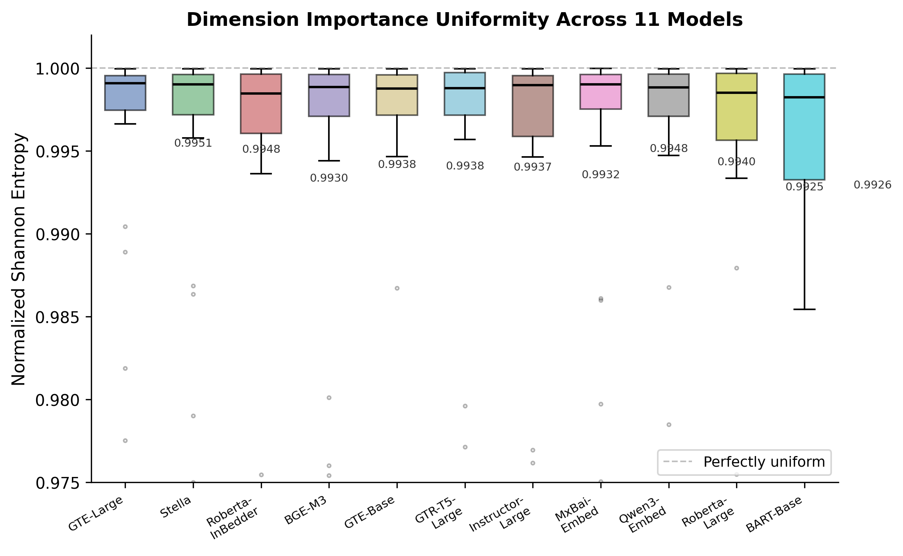
</p>

### Basis Independence

<p align="center">
  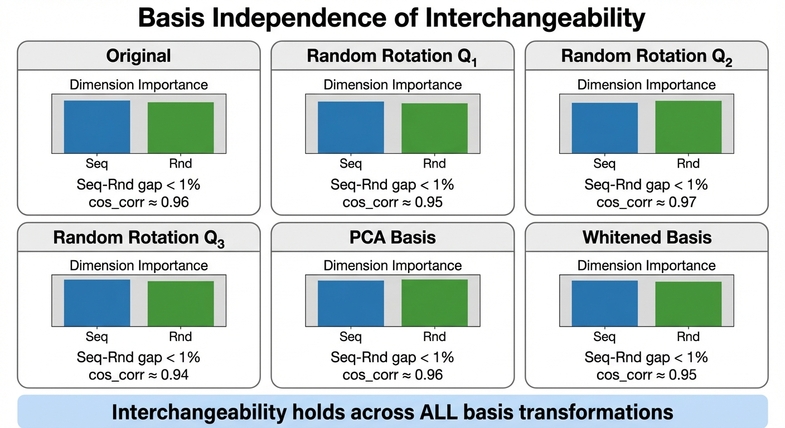
</p>

Interchangeability holds under **all tested basis transformations**—original, random orthogonal rotations, PCA, and whitening. The sequential–random gap remains below 1% in every basis, confirming the property is intrinsic to the representation, not an artifact of the coordinate system.

### Boundary Case: Task-Specific Fine-Tuning

Roberta-Large-InBedder (task-specifically fine-tuned for retrieval) shows the largest optimized–random gap (+8.19%), confirming that **specialized training creates exploitable dimension structure**. This provides a practical diagnostic: a large optimized–random gap indicates a model is specialized for narrow tasks.

### Optimized vs Random Scatter

<p align="center">
  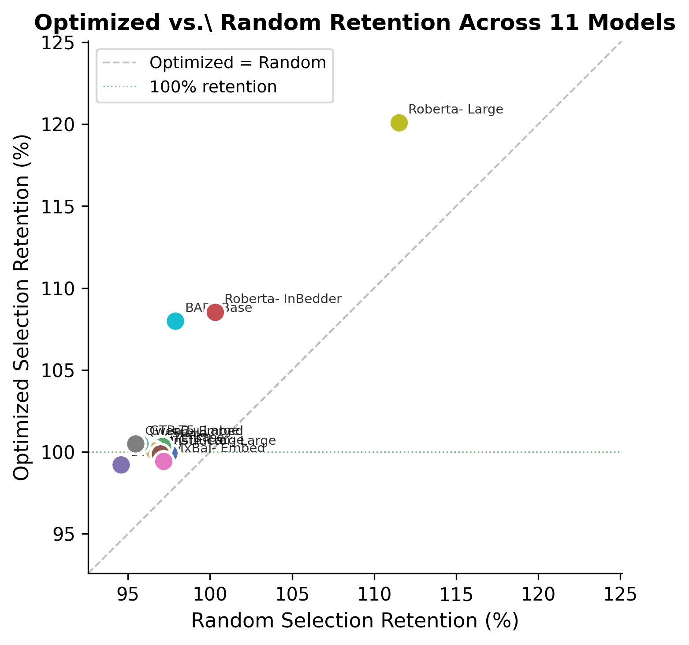
</p>

All 11 models cluster near the diagonal with optimized slightly above random.

---

## Models Evaluated

We evaluate **13 models** spanning diverse architectures:

| Model | Dims | Training | Detailed Analysis |
|-------|------|----------|:-:|
| GTE-Large | 1024 | Contrastive | ✓ |
| Stella EN 400M | 1024 | Contrastive | ✓ |
| Roberta-Large-InBedder | 1024 | Task-specific fine-tuning | ✓ |
| BGE-M3 | 1024 | Multi-lingual contrastive | |
| GTE-Qwen2 | 1536 | Contrastive | |
| Qwen3-Embedding | 1024 | Contrastive | |
| MxBai-Embed-Large | 1024 | Contrastive | |
| Instructor-Large | 768 | Instruction-tuned | |
| GTE-Base | 768 | Contrastive | |
| GTR-T5-Large | 768 | Contrastive | |
| Roberta-Large | 1024 | MLM only | |
| BART-Base | 768 | Denoising autoencoder | |

All models are evaluated on **35 MTEB tasks** across 6 categories: Classification, Clustering, Retrieval, Reranking, STS, and Pair Classification.

## Dimension Selection Methods

| Method | Selection Criterion | Task-aware? | Cost |
|--------|-------------------|:-----------:|:----:|
| **Random** | Uniform sampling (10 trials) | No | Zero |
| **Sequential** | First k dimensions (intrinsic order) | No | Zero |
| **Magnitude** | Highest L2 weight norm per dim | No | Zero |
| **Optimized (Oracle)** | Highest chunk-level task score | Yes | O(N·|T|) |
| **Anti-optimized** | Lowest chunk-level task score | Yes | O(N·|T|) |

---

## Repository Structure

```
├── paper/              # Paper source
│   ├── main.tex        # LaTeX source
│   ├── paper.pdf       # Compiled PDF
│   ├── references.bib  # Bibliography
│   └── figures/        # All figures (19 images)
├── src/                # Code
│   ├── rank_chunk_mteb.py           # Main MTEB chunk evaluation
│   ├── basis_sensitivity.py         # Basis independence experiment
│   ├── universal_mask_experiment.py # Universal mask transfer
│   ├── near_optimal_mask_analysis.py # Near-optimal mask degeneracy
│   ├── magnitude_pruning.py         # Magnitude pruning analysis
│   ├── task_similar_mteb.py         # Cross-task similarity
│   ├── redesign_figures.py          # Figure generation
│   └── ...                          # Additional scripts & notebooks
├── data/               # Experimental data (HuggingFace)
│   ├── analyze/        # Chunk importance scores (3 models)
│   ├── mteb/           # MTEB evaluation results (13 models)
│   ├── task_similar/   # Cross-task transfer data (12 models)
│   └── experiment_results/  # Analysis outputs
└── README.md
```

## Data

Full experimental data is available on **HuggingFace**: [heihei/prune-to-prosper-data](https://huggingface.co/datasets/heihei/prune-to-prosper-data)

### Quick Start with Data

```python
import json

# Load chunk importance for GTE-Large
with open("data/analyze/gte-large-en-v1.5.json") as f:
    data = json.load(f)

# Get chunk importance for a specific task
task = "Banking77Classification"
scores = data["task_name"][task]["split_win_size"]["2"]["chunk_result"]
print(f"Number of chunks: {len(scores)}")  # 512
print(f"Top-10 most important: {sorted(range(len(scores)), key=lambda i: scores[i], reverse=True)[:10]}")

# Load basis independence results
with open("data/experiment_results/basis_sensitivity_gte-large.json") as f:
    basis = json.load(f)
for name, result in basis["basis_results"].items():
    gap = result["seq_vs_random_cos_corr_gap"]
    print(f"{name}: Seq-Rnd gap = {gap:.4f}")
```

### Reproduce Experiments

```bash
# Install dependencies
pip install sentence-transformers mteb torch numpy scipy matplotlib seaborn

# Run basis sensitivity experiment
python src/basis_sensitivity.py --model gte-large --gpu 0

# Run near-optimal mask analysis
python src/near_optimal_mask_analysis.py --model gte-large

# Generate paper figures
python src/redesign_figures.py
```

## Citation

```bibtex
@inproceedings{dimensions-interchangeable-2026,
  title={Dimensions Are Interchangeable: Evidence That Task-Aware Embedding Pruning Does Not Outperform Random Selection},
  author={Anonymous},
  booktitle={Proceedings of the 2026 Conference on Empirical Methods in Natural Language Processing},
  year={2026}
}
```

## License

MIT
